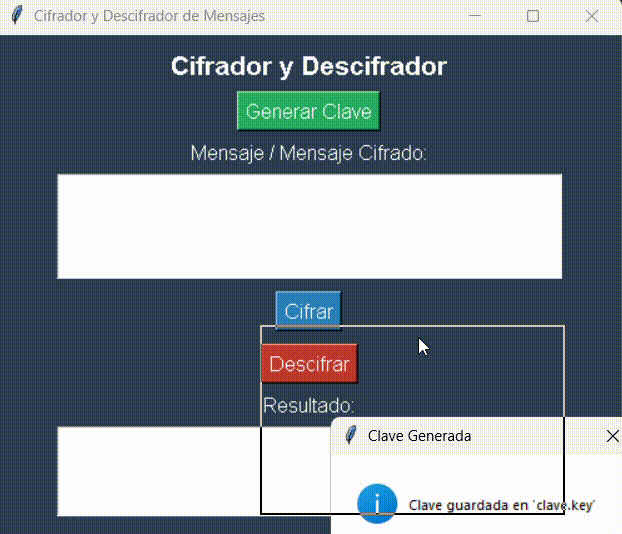

# 🔐 Cifrador y Descifrador de Mensajes

Este proyecto permite cifrar y descifrar mensajes utilizando la librería `cryptography`. Implementa una interfaz gráfica amigable con `Tkinter` para facilitar su uso.

---

## 📂 Estructura del Proyecto

```
📦 cifrador-mensajes
 ├── 📜 cifrador.py        # Módulo de cifrado y descifrado de mensajes
 ├── 📜 interfaz.py        # Interfaz gráfica con Tkinter
 ├── 📜 main.py            # Archivo principal para ejecutar la aplicación
 ├── 🔑 clave.key          # Archivo de clave de cifrado (generado automáticamente)
 ├── 📜 README.md          # Documentación del proyecto
```

---

## 🚀 Instalación y Uso

### 🔧 1. Requisitos
Este proyecto utiliza Python 3.8 o superior. Para instalar las dependencias necesarias, ejecuta:

```sh
pip install cryptography
```

### ▶️ 2. Ejecución
Para iniciar la aplicación, simplemente ejecuta:

```sh
python main.py
```

---

## 🎨 Interfaz Gráfica

- **Generar Clave:** Genera una clave para cifrado y la guarda en `clave.key`.
- **Cifrar Mensaje:** Convierte un texto en un mensaje cifrado.
- **Descifrar Mensaje:** Recupera el mensaje original con la clave correcta.

### 🎥 Ejemplo de Uso




---

## 🔒 Seguridad
- **No compartas el archivo `clave.key`** con nadie, ya que es necesario para descifrar los mensajes.
- **Si pierdes la clave, los mensajes cifrados no podrán ser recuperados.**

---

## 🔗 Descarga

Puedes descargar el programa como ejecutable para Microsoft Windows aca:

https://drive.google.com/file/d/1lXELKh1uO3qDOsAC5svgSKWaMFmiXlFy/view?usp=drive_link

## 📜 Licencia
Este proyecto está bajo la licencia GNU. ¡Siéntete libre de modificarlo y mejorarlo! 🎉

---

## 🤝 Contribuciones
¿Tienes ideas para mejorar el proyecto? ¡Siéntete libre de hacer un fork y enviar un Pull Request!

💡 **Autor:** Israel Monjes
